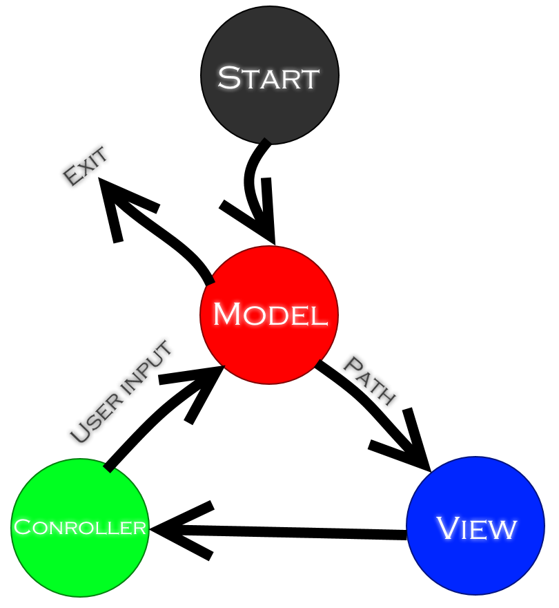

# texto-textQuestEngine
Texto - it's a simple text quest engine. Using it you can at simple way create simple text quests.  
  
There is a architecture diagram of program:  
  
It created through architectural pattern MVC.  
P.S. Path - it's a path to main quest file.
