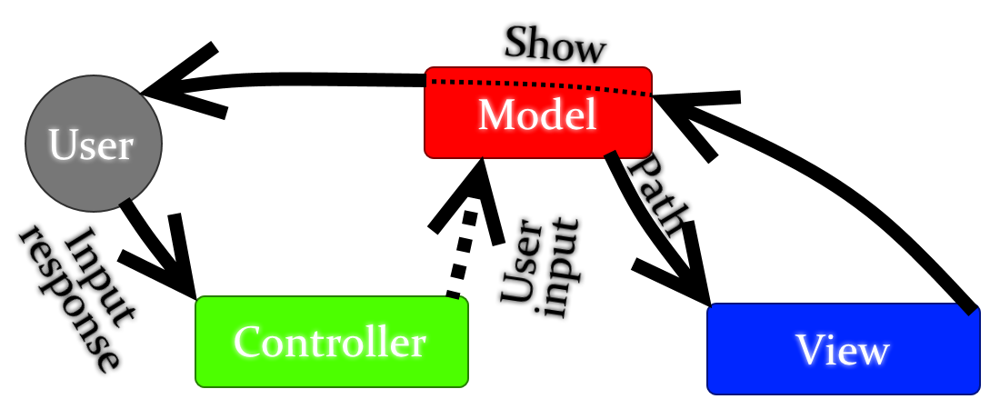

# texto-textQuestEngine
Texto - it's a simple text quest engine. Using it you can at simple way create simple text quests.  
  
There is a architecture diagram of program:  
  
It created through architectural pattern MVC.  
P.S. Path - it's a path to main quest file.
P.P.S User isn't exist in program, there is it drawn for show, that what is visualizing View is interesting only to user, not to controller module.
